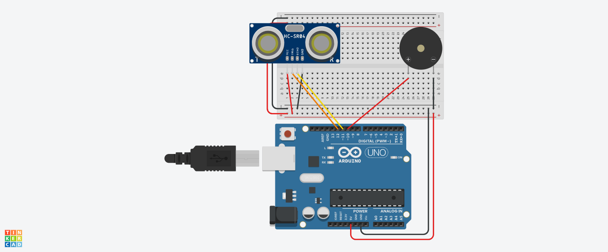
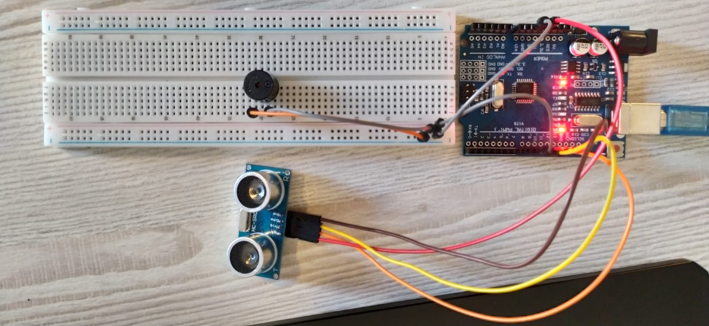

## Simple distance-based alert system using HC-SR04 and an Active Buzzer.

### Features
- Measures distance from 3 to 500cm.
- Beep frequency and volume increase as objects get closer.

### Components
- Arduino Uno
- HC-SR04 ultrasonic sensor
- Active Buzzer
<table>
  <tr>
    <td><b>Circuit Diagram</b></td>
    <td><b>Circuit</b></td>
  </tr>
  <tr>
    <td></td>
    <td></td>
  </tr>
</table>
