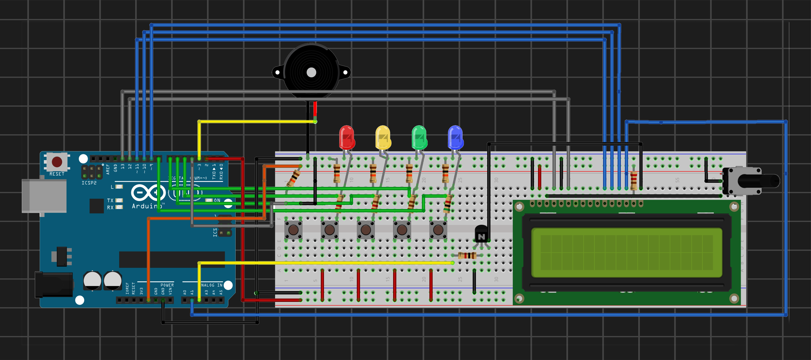

## 03 - Simon Game

A memory game where the user must replicate a randomly generated sequence of flashing LEDs and sounds, featuring real-time score tracking and long-term high score storage.

### Components
- Arduino Uno
- x4 Buttons (with external pull-down 10kΩ resistors)
- x1 Button (power button with external pull-up 1KΩ resistor)
- x4 LEDs (Red, Yellow, Green, Blue)
- x1 16x2 LCD Screen
- x1 10kΩ Potentiometer (for contrast adjustment)
- x1 2N2222A BJT Transistor (for electronic low-side power switching of the LCD)
- x1 1kΩ Resistor (BJT Base current limiter)
- x1 220Ω Resistor (LCD Backlight current limiter)
- 220Ω / 220Ω / 110Ω / 5KΩ Resistors (LED current limiters)
- x1 Passive Buzzer

### Features
* **BJT Backlight Switching:** Implements a low-side transistor circuit to fully control the LCD backlight via an Arduino digital pin.
* **Non-Volatile Storage:** Uses the internal EEPROM (address 0) to save and load the global highest score, keeping data safe even when unplugged.
* **Formatted LCD Layout:** Real-time top line tracking for the global record (`Highest:`) and bottom line for the live round (`Score:`).

| Circuit Schematic | Demo |
| :---: | :---: |
|  |  |
