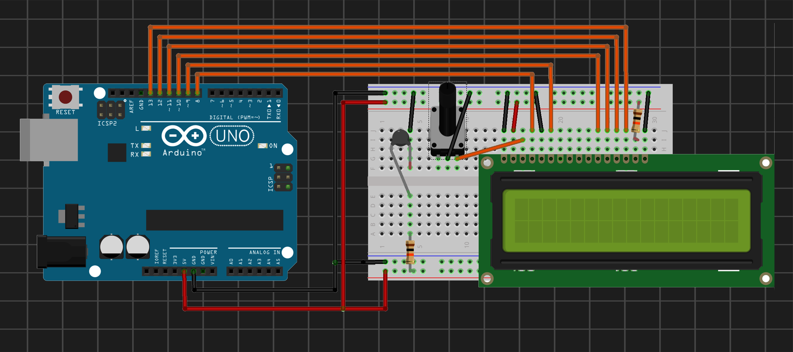
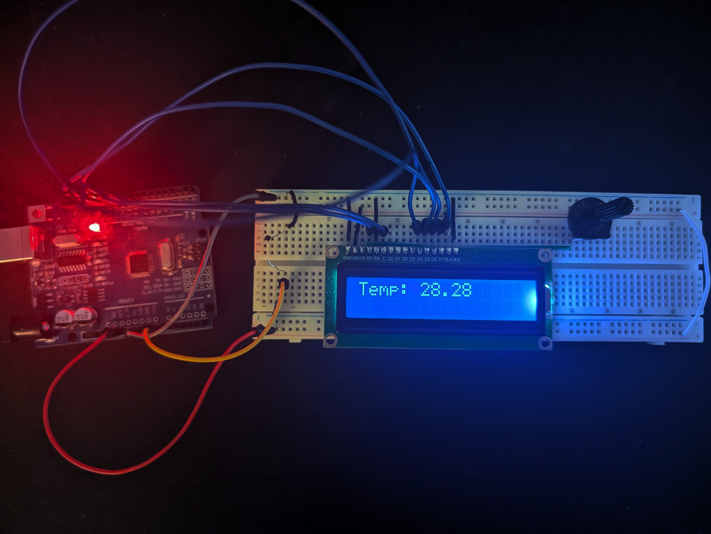

## 04 - NTC_Thermometer

A real-time ambient temperature thermometer that processes raw analog signals from an NTC thermistor using the logarithmic Beta formula and outputs formatted data onto an LCD screen.

### Components
- Arduino Uno
- x1 NTC 10kΩ Thermistor
- x1 16x2 LCD Screen
- x1 10kΩ Potentiometer (for contrast adjustment)
- x1 10kΩ Resistor (static voltage divider reference)

| Circuit Schematic | Setup |
| :---: | :---: |
|  |  |
